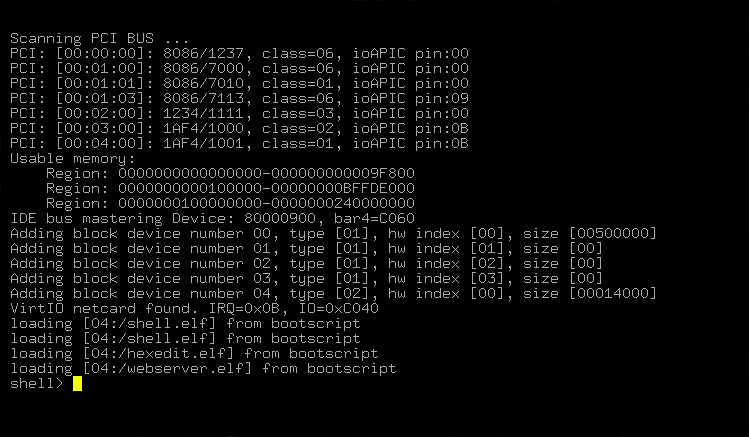
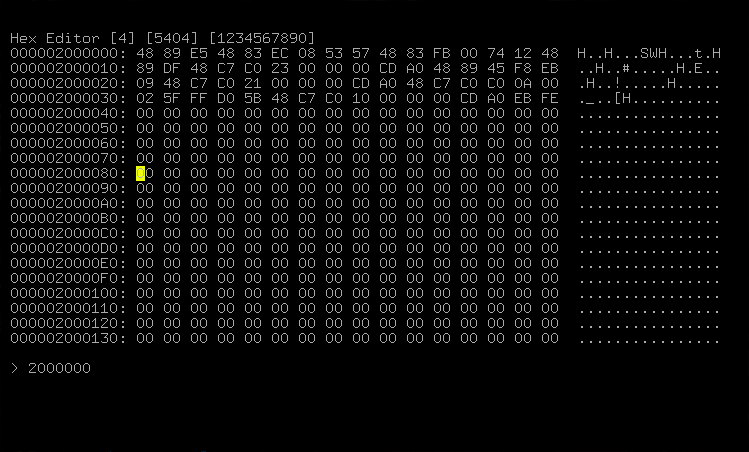
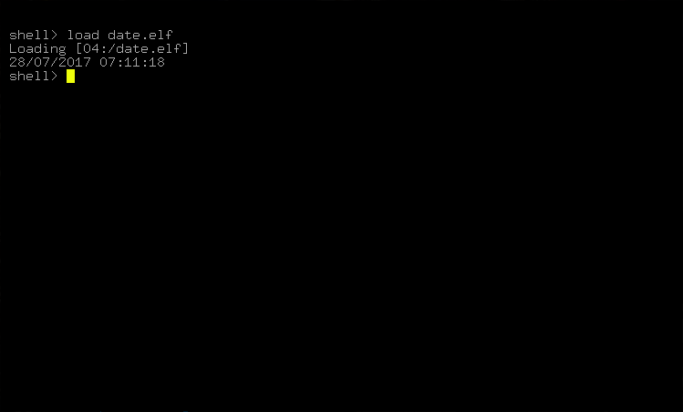
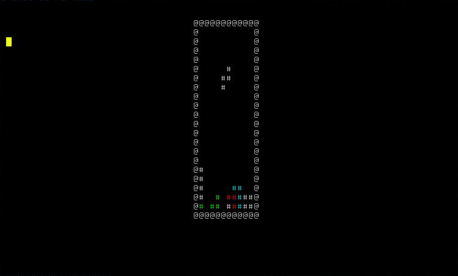
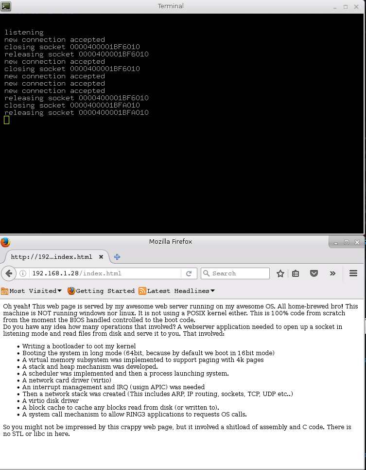

# bare metal x86_64 OS

## Specifications
    disk is a raw image with no MBR or partition
    user applications are stored in a tar file. The tar file is used as a readonly disk
        using "flatfs" as the "tar" filesystem
    paging uses identity mapping of the 2first mb with 2mb pages
      and virtual memory addresses with bit 46 set are mirror addresses.
            meaning that gig #65536 maps to gig #0.
            
    supports ring3 user threads and ring0 kernel threads
    supports multiprocessors
    Supports AVX
    supports APIC, and not PIC
    supports PCID and does TLB shootdowns
    supports sending IPIs and registering custom handlers
    supports RTL8139 netcard on PCI bus
    supports virtio block device and virtio net device.
    networking works but not fully tested
        - can receive TCP connection and establish one
        - send/rcv
        - no failure testing
    basic hypervisor
        CPU virtualization with VMX
        no BIOS
        no virtual devices
        no emulation of A20M
        

## Screenshots
### Booting

### Hex editor

### Simple shell

### tetris

### web server

